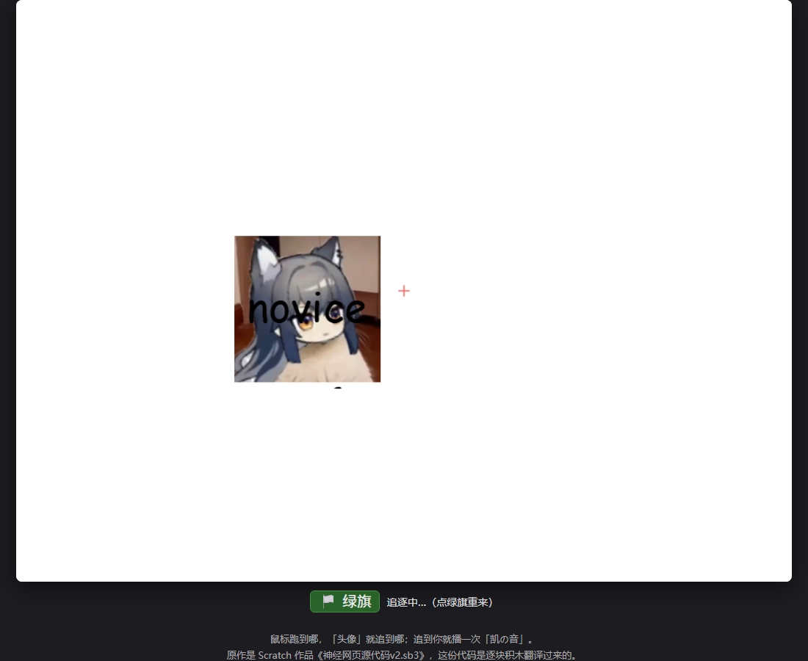

# novice追逐赛 🏃

> 一个用 Scratch 拼出来的恶搞小游戏：**鼠标跑到哪，「头像」就追到哪；被抓到就播一次「凯の音」**，
> 下面还挂着一行 `novice` 一直贴着头像跑。
> 原作是 Scratch 3 工程，现已**逐块积木翻译**成 JavaScript 和 Python，玩法一模一样。

## 🎮 在线试玩

### 👉 https://shamate-tv.github.io/a-follish-game-of-Novice-/web/

打开就能玩（手机也行）：点「🏳 绿旗」或按 **空格** 开始，然后……鼠标动起来就完事了 😈

| 想玩哪个版本 | 地址 |
|---|---|
| **JavaScript 移植版（推荐）** | https://shamate-tv.github.io/a-follish-game-of-Novice-/web/ |
| 原版 Scratch 打包版 | https://shamate-tv.github.io/a-follish-game-of-Novice-/main.html |
| Python 桌面版 | 把仓库拉下来：`python novice_chase.py`（在 `python/` 目录里） |



## 📁 目录里都是啥

```
main.html                 ← Scratch 打包机生成的播放器（2.9 MB，99% 是虚拟机引擎）
神经网页源代码v2.sb3        ← ★ 原始 Scratch 工程，想改玩法先改这个（TurboWarp / mBlock 打开）
web/                      ← JavaScript 移植版（就是上面在线试玩那个）
  ├── index.html            页面，只有 60 行
  ├── game.js               游戏逻辑，积木全在这里
  ├── assets/               头像 avatar.png + 音效 kai.wav
  └── tools/test-sim.js     不用浏览器的自测，32 项检查
python/
  ├── novice_chase.py     ← Python 移植版（tkinter，只用标准库，不用装东西）
  └── assets/
preview.png               截图
```

## ▶️ 怎么跑

**网页版（本地）**

```bash
cd web
python -m http.server 8000     # 或 VSCode 的 Live Server
# 浏览器打开 http://localhost:8000/
```

> ⚠️ 别直接双击 `index.html`。`file://` 下浏览器不允许读图片像素，「碰到鼠标指针」会退化成矩形判定；
> 用本地服务器打开就完全正常。

**Python 版**

```bash
cd python
python novice_chase.py         # Python 3.8+，tkinter 是自带的，Windows / macOS / Linux 都能跑
```

**自测**（不需要浏览器，也不需要装依赖）

```bash
cd web && node tools/test-sim.js
```

## 🧩 积木 → 代码 对照表

| Scratch 积木 | JavaScript (`web/game.js`) | Python (`python/novice_chase.py`) |
|---|---|---|
| 当绿旗被点击 | `Sim.greenFlag()` | `Game.green_flag()` |
| 重复执行 { … } | `while (true) { … yield; }` | `while True: … yield 1` |
| 将大小设为 (50) % | `sprite.setSize(50)` | `avatar.size = 50` |
| 将旋转模式设为 [左右翻转] | `sprite.rotationStyle = 'left-right'` | `avatar.rotation_style = 'left-right'` |
| 面向 [鼠标指针] | `sprite.pointTowardsMouse()` | `avatar.point_towards_mouse(mouse)` |
| 移动 (10) 步 | `sprite.moveSteps(10)` | `avatar.move_steps(10)` |
| 碰到 [鼠标指针]？ | `sprite.touchingMouse()` | `avatar.touching_mouse(mouse)` |
| 播放声音 [凯の音] 等待播完 | `yield* playSoundUntilDone(sprite)` | `yield from play_sound_until_done(...)` |
| 移到 [头像] | `sprite.goTo(avatar)` | `name.go_to(avatar)` |

「重复执行」在代码里就是 `while` 循环 + 每圈末尾 `yield` 一次，**一次 `yield` = 一帧**；
「等待播完」是靠 `yield` 掉「声音时长 × 30」帧实现的，所以脚本会卡住，和 Scratch 表现一致。

## 🔧 想改玩法？

| 想改什么 | 网页版 | Python 版 |
|---|---|---|
| 追得更快 / 更慢 | `moveSteps(10)` 里的 10 | `move_steps(10)` 里的 10 |
| 头像大小 | `avatar.setSize(50)` | `avatar.size = 50` |
| 换音效 | 换 `web/assets/kai.wav` | 换 `python/assets/kai.wav` |
| 换头像 | 换 `web/assets/avatar.png` | 换 `python/assets/avatar.png` |
| 下面那行字 | `text: 'novice'` | `text="novice"` |
| 帧率 | `game.js` 顶部 `const FPS = 30` | `novice_chase.py` 顶部 `FPS = 30` |

## 🎯 移植时特意对齐的细节

Scratch 的虚拟机源码就打包在 `main.html` 里，下面这些都是照着里面的实现翻译的：

* **舞台 480×360**，原点在正中，x 向右、y 向上；角色坐标、造型旋转中心都按原工程抄
* **30 帧/秒**（TurboWarp 默认值，虚拟机里就是 `setFramerate(30)`），每帧每个「重复执行」跑一圈
* **左右翻转**：虚拟机里是 `direction < 0 ? -1 : 1`，所以是**朝左**才镜像
* **碰到鼠标指针**是**逐像素**判定（`isTouchingPoint`），鼠标只算一个点；鼠标跑出舞台会被夹到舞台边上
* **图片是「两倍图」**：`bitmapResolution = 2`，362×378 的图在舞台上只占 181×189，再乘大小 50% = 90.5×94.5
* **播放声音等待播完**期间脚本卡住（47 帧 ≈ 1.557 秒），卡住时「名字」照旧跟着头像
* 脚本启动顺序：先「头像」后「名字」，所以每帧「名字」贴的是头像**移动之后**的位置

验证方式：`node tools/test-sim.js` 32 项检查全过，另外用无头浏览器截图和独立算出来的坐标对比，误差 < 1 个屏幕像素。

## ❓ 为什么以前 GitHub 说这个仓库是 HTML

GitHub 是按**文件字节数**猜语言的。仓库里 `main.html`（2.96 MB）是打包机生成的播放器，
里面 99% 是 Scratch 虚拟机引擎（不是我们写的代码），而 `.sb3` 是 zip 二进制不计入统计，
于是就成了「100% HTML」。

解决办法：根目录放一个 `.gitattributes`，把打包产物标记成生成物——

```gitattributes
main.html linguist-generated=true
*.sb3 linguist-detectable=false
```

这样 GitHub 只统计 `web/` 和 `python/` 里的真实源码，语言标签就正常了。

## 📜 素材 & 说明

* 原工程：`神经网页源代码v2.sb3`（作者：shamate-tv，Scratch 3 / TurboWarp）
* `assets/avatar.png`（362×378）、`assets/kai.wav`（48 kHz / 1.557 秒）都是从原工程里原样抽出来的
* 「名字」在原作里是 SVG 造型，移植版直接画文字；原作用的是 Scratch 自带的 `Marker` 字体，
  系统里没有这个字体时会用兜底字体代替，所以字的宽窄可能和原版略有差别

想看原版是怎么拼的，用 [TurboWarp](https://turbowarp.org/editor) 或 mBlock 打开 `.sb3` 就能看到积木。
